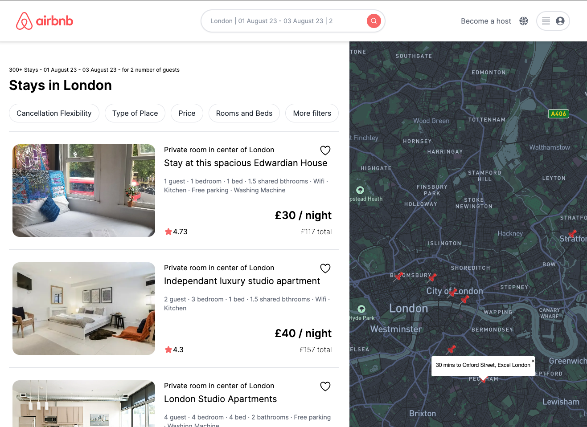

# Airbnb Clone with Next.js



## Mapbox

Mapbox Studio provides tools for converting your data to tilesets and creating styles.
Select **New style** and choose **Navigation** template.

### Customize Navigation

1. Go to **Road network** and change color of **Motorways and trunks** to `#FD5B61`
2. Click **Shared Icon** to get **Style URL** and **Access token**
3. Install `react-map-gl` to your React project


## Getting Started

First, run the development server:

```bash
npm run dev
# or
yarn dev
# or
pnpm dev
```

Open [http://localhost:3000](http://localhost:3000) with your browser to see the result.

You can start editing the page by modifying `app/page.tsx`. The page auto-updates as you edit the file.

This project uses [`next/font`](https://nextjs.org/docs/basic-features/font-optimization) to automatically optimize and load Inter, a custom Google Font.

## Deploy to Vercel

Visit  [website](https://airbnb-clone-react-gold.vercel.app/)

